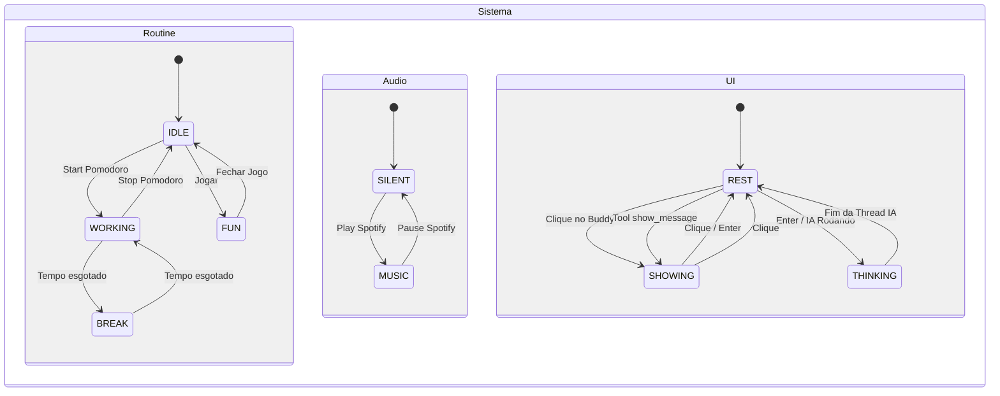

# DesktopBuddy

O **DesktopBuddy** é um assistente de desktop inteligente que vive no canto da sua tela. Ele é um companheiro animado (via sprites em GIF) capaz de executar ações no seu computador através de uma IA orientada por ferramentas. O Buddy integra-se com o **Spotify** e o **Trello**, ajuda a gerenciar seu modo de trabalho (incluindo ciclos Pomodoro) e monitora sua produtividade analisando a janela ativa.

---

## Sumário

- [Visão Geral](#visão-geral)
- [Funcionalidades](#funcionalidades)
- [Arquitetura](#arquitetura)
- [Máquina de Estados](#máquina-de-estados)
- [Ferramentas Disponíveis](#ferramentas-disponíveis)
- [Pré-requisitos](#pré-requisitos)
- [Instalação](#instalação)
- [Configuração](#configuração)
- [Uso](#uso)
- [Estrutura do Projeto](#estrutura-do-projeto)

---

## Visão Geral

O DesktopBuddy combina uma interface gráfica leve (construída com `tkinter`) com um agente de IA baseado em chamada de ferramentas (tool-calling agent) usando a biblioteca `smolagents`. O agente pode decidir, autonomamente, quais ferramentas utilizar para responder às solicitações do usuário, controlando música, tarefas e o próprio comportamento do companheiro na tela.

O projeto foi pensado para rodar no **Windows**, fazendo uso de recursos nativos como movimento de janela sem bordas, transparência e minimização de janelas.

---

## Funcionalidades

- **Companheiro animado na tela**: um sprite em GIF que reage ao estado do sistema (ocioso, trabalhando, pensando, mostrando mensagem, ouvindo música).
- **Interação por comando de texto**: clique no Buddy para abrir uma caixa de entrada e envie comandos em linguagem natural.
- **Controle do Spotify**: tocar playlists/faixas, pausar, retomar e verificar o estado da reprodução via API oficial.
- **Integração com Trello**: visualizar o quadro de tarefas como um painel flutuante, listar cards pendentes, ler descrições e abrir automaticamente recursos associados a uma tarefa (URLs, projetos no VS Code / IntelliJ, comandos e arquivos locais).
- **Modo de Trabalho / Pomodoro**: ativa um ciclo de trabalho e intervalos, controlando a música do Spotify automaticamente entre os períodos.
- **Avaliação de produtividade**: o Buddy analisa periodicamente a janela ativa e, se detectar distração, envia uma mensagem encorajando o retorno ao trabalho.
- **Arraste o Buddy**: segure e arraste o personagem para qualquer 위치 da tela.

---

## Arquitetura

O projeto é estruturado em torno de três pilares principais:

### 1. `DesktopBuddy` (`src/DesktopBuddy.py`)
Classe central que gerencia a interface gráfica (janela transparente, GIF animado, caixa de comando, painel do Trello e mensagens da IA). Ela mantém referências aos clientes do Spotify e do Trello, controla a thread de trabalho (Pomodoro) e despacha comandos para o agente de IA.

### 2. `DesktopAgent` (`src/DesktopAgent.py`)
Encapsula o `ToolCallingAgent` da `smolagents`. Recebe mensagens do usuário, eventos internos do sistema (como `work_started`, `pause_music`) e solicitações de avaliação de produtividade, decidindo quais ferramentas chamar. O prompt de sistema que orienta seu comportamento está em `src/prompts/system_prompt.txt`.

### 3. `BuddyStateManager` (`src/StateManager.py`)
Gerencia três dimensões independentes de estado, combinadas para definir qual sprite será exibido:

- **RoutineState**: `IDLE`, `WORKING`, `BREAK`, `FUN`
- **AudioState**: `SILENT`, `MUSIC`
- **UIState**: `REST`, `SHOWING`, `THINKING`

A comunicação entre threads (IA e UI) é feita via uma `queue.Queue` de sprites.

---

## Máquina de Estados



---

## Ferramentas Disponíveis

O agente possui as seguintes ferramentas (definidas em `src/tools.py`):

| Ferramenta | Descrição |
|------------|-----------|
| `play_spotify_playlist_or_track` | Toca uma playlist ou faixa específica no Spotify. |
| `pause_spotify` | Pausa a reprodução atual do Spotify. |
| `resume_spotify` | Retoma a reprodução do Spotify. |
| `verify_spotify` | Retorna o estado atual do Spotify (1 = tocando, 0 = pausado, -1 = indisponível). |
| `analyse_active_window` | Obtém o título da janela atualmente em foco. |
| `show_message` | Exibe uma mensagem textual ao usuário. |
| `work_mode_manager` | Ativa/desativa o modo de trabalho, com suporte a ciclos Pomodoro. |
| `trello_task_viewer` | Abre o painel visual das tarefas pendentes do Trello. |
| `trello_card_list` | Lista os cards pendentes do Trello (nome e ID). |
| `trello_get_card_description` | Obtém a descrição completa de um card específico. |
| `task_launcher` | Abre automaticamente todos os recursos associados a um card (URLs, VS Code, IntelliJ, comandos, arquivos). |

---

## Pré-requisitos

- **Python 3.11+**
- **Windows** (o projeto usa APIs específicas do Windows como `os.startfile`, transparência de janela e caminhos do Ollama)
- **Ollama** instalado (serviço de LLM local usado como fallback) — caminho esperado: `%LOCALAPPDATA%\Programs\Ollama\ollama.exe`
- **Spotify Premium** (necessário para controle via API)
- Conta no **Trello** com um quadro configurado
- **Chave de API do Google Gemini** (ou outro provedor compatível com `litellm`)

### Dependências Python

As dependências estão listadas em `requirements.txt`:

```
smolagents==1.26.0
litellm==1.86.2
openai==2.40.0
py-trello==0.20.1
spotipy==2.26.0
redis==8.0.0
pillow==12.2.0
PyGetWindow==0.0.9
PyRect==0.0.9
python-dotenv==1.2.2
rich==15.0.0
tqdm==4.67.3
```

---

## Instalação

1. **Clone o repositório:**

   ```bash
   git clone https://github.com/<seu-usuario>/DesktopBuddy.git
   cd DesktopBuddy
   ```

2. **Crie e ative um ambiente virtual:**

   ```powershell
   python -m venv venv
   .\venv\Scripts\Activate.ps1
   ```

   > Caso o PowerShell bloqueie a execução, permita temporariamente com:
   > ```powershell
   > Set-ExecutionPolicy -Scope Process -ExecutionPolicy RemoteSigned
   > ```

3. **Instale as dependências:**

   ```bash
   pip install -r requirements.txt
   ```

4. **Instale o Ollama** (opcional, para o modelo local):
   - Baixe em [ollama.com](https://ollama.com) e instale.
   - O serviço será iniciado automaticamente pelo projeto caso não esteja rodando.

---

## Configuração

### Variáveis de Ambiente

Crie um arquivo `.env` na raiz do projeto com as seguintes variáveis:

```env
# Spotify
SPOTIPY_CLIENT_ID=seu_client_id
SPOTIPY_CLIENT_SECRET=seu_client_secret
SPOTIPY_REDIRECT_URI=http://localhost:8888/callback

# Trello
TRELLO_API_KEY=sua_api_key
TRELLO_API_SECRET=seu_api_secret
TRELLO_TOKEN=seu_token
TRELLO_BOARD_ID=id_do_seu_quadro

# Google Gemini (ou outro provedor via litellm)
GEMINI_API_KEY=sua_chave_api
```

> **Spotify**: registre um aplicativo em [developer.spotify.com](https://developer.spotify.com) e configure a `redirect_uri` informada acima.
>
> **Trello**: obtenha suas credenciais em [trello.com/power-ups/](https://trello.com/power-ups/dashboard) e o `board_id` na URL do seu quadro.

### Arquivo `config.json`

Define os caminhos dos sprites, a playlist padrão de trabalho e as dimensões da janela:

```json
{
    "sprites": {
        "IDLE_SILENT": "assets/DesktopBuddySprite_Idle.gif",
        "IDLE_MUSIC": "assets/DesktopBuddySprite_Idle_Music.gif",
        "WORKING_SILENT": "assets/DesktopBuddySprite_Working.gif",
        "WORKING_MUSIC": "assets/DesktopBuddySprite_Working_Music.gif",
        "BREAK_SILENT": "assets/DesktopBuddySprite_Idle.gif",
        "BREAK_MUSIC": "assets/DesktopBuddySprite_Idle_Music.gif",
        "FUN_SILENT": "assets/DesktopBuddySprite_Idle.gif",
        "FUN_MUSIC": "assets/DesktopBuddySprite_Idle_Music.gif",
        "SHOWING": "assets/DesktopBuddySprite_Showing.gif",
        "THINKING": "assets/DesktopBuddySprite_Thinking.gif"
    },
    "spotify": {
        "default_work_playlist": "https://open.spotify.com/playlist/<id>"
    },
    "ui": {
        "window_width": 260,
        "window_height": 260
    }
}
```

---

## Uso

1. Certifique-se de que o Spotify está instalado e que você está logado.
2. Inicie o projeto:

   ```powershell
   .\venv\Scripts\Activate.ps1
   python main.py
   ```

3. O Buddy aparecerá no canto inferior direito da tela.
4. **Clique no Buddy** para abrir a caixa de comando e digite instruções como:

   - *"Mostra minhas tarefas"*
   - *"Vamos trabalhar"*
   - *"Inicia um pomodoro de 25 minutos de trabalho e 5 de descanso, 4 ciclos"*
   - *"Toca uma música"*
   - *"Pausa a música"*
   - *"Abre a tarefa X"*
   - *"O que estou fazendo agora?"*

5. O Buddy pode exibir mensagens, abrir painéis e executar ações automaticamente.

---

## Estrutura do Projeto

```
DesktopBuddy/
├── main.py                      # Ponto de entrada: inicializa o Buddy e o agente
├── config.json                  # Configurações de sprites, Spotify e UI
├── requirements.txt             # Dependências Python
├── state_chart.md               # Diagrama de estados (Mermaid)
├── tests.py                     # Testes manuais (ex: Trello, janela ativa)
├── assets/                      # Sprites em GIF do Buddy
│   ├── DesktopBuddySprite_Idle.gif
│   ├── DesktopBuddySprite_Working.gif
│   ├── DesktopBuddySprite_Thinking.gif
│   └── DesktopBuddySprite_Showing.gif
└── src/
    ├── DesktopBuddy.py          # Lógica principal e interface gráfica
    ├── DesktopAgent.py          # Encapsula o agente de IA (tool-calling)
    ├── StateManager.py          # Máquina de estados (Rotina, Áudio, UI)
    ├── tools.py                 # Ferramentas disponíveis para a IA (Spotify, Trello, etc.)
    ├── utils.py                 # Inicialização do Ollama e Spotify em segundo plano
    └── prompts/
        └── system_prompt.txt    # Prompt de sistema que guia o comportamento do agente
```

---

## Notas

- O projeto foi desenvolvido e testado no **Windows**. Detalhes como transparência de janela e minimização do Spotify dependem de APIs específicas do sistema.
- O modelo de IA padrão utilizado é o **Google Gemini** (`gemini-3.1-flash-lite`), com fallback local para o **Ollama** (`gemma4:e2b`). Ambos podem ser ajustados em `main.py`.
- O `DesktopAgent` limita a execução a **5 passos** por solicitação (`max_steps=5`), conforme definido no prompt de sistema.
